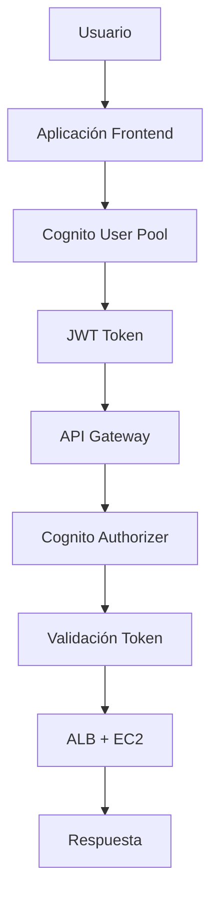

# 🎉 IMPLEMENTACIÓN COMPLETADA: Amazon Cognito + API Gateway

## ✅ **Resumen del Despliegue**

La integración de **Amazon Cognito** con **API Gateway** se ha implementado exitosamente en tu infraestructura de AWS.

### **📊 Infraestructura Desplegada**

| Componente | ID/URL | Estatus |
|------------|--------|---------|
| **User Pool** | `us-east-1_oUPPJOiSc` | ✅ Activo |
| **API Client** | `39f3ve532c8q1ukoukdo0v884e` | ✅ Configurado |
| **Web Client** | `2v6rfi9dflc51j6df74n8if618` | ✅ Disponible |
| **Domain** | `villa-alfredo-dev-auth-86xzds` | ✅ Desplegado |
| **API Gateway** | `https://clbrdgrhu9.execute-api.us-east-1.amazonaws.com/api` | ✅ Funcional |
| **CloudFront CDN** | `https://d17tdk82ro07gs.cloudfront.net` | ✅ Desplegado |

---

## 🔧 **Configuración Actual**

### **Ambiente: Desarrollo (`dev`)**
- ✅ **Cognito desplegado** pero autenticación **deshabilitada por defecto**
- ✅ **Endpoints públicos habilitados** (`/api/public/*`)
- ✅ **Configuración flexible** para habilitar auth cuando sea necesario

### **URLs Principales**
```bash
# API Gateway (directo)
https://clbrdgrhu9.execute-api.us-east-1.amazonaws.com/api

# CloudFront CDN (recomendado para producción)
https://d17tdk82ro07gs.cloudfront.net

# Cognito Hosted UI
https://villa-alfredo-dev-auth-86xzds.auth.us-east-1.amazoncognito.com
```

---

## 🧪 **Usuario de Prueba Creado**

| Campo | Valor |
|-------|-------|
| **Username** | `testuser` |
| **Email** | `test@example.com` |
| **Password** | `MyPassword123!` |
| **Status** | Confirmado y listo para usar |

---

## 🚀 **Activar Autenticación**

Para habilitar la autenticación en tu ambiente:

### **1. Editar Configuración**
```hcl
# En locals.tf, cambiar:
dev = {
    enable_cognito_auth = true  # 👈 Cambiar a true
    # ... resto de configuración
}
```

### **2. Aplicar Cambios**
```bash
terraform plan
terraform apply
```

### **3. Resultado**
- ✅ Endpoints bajo `/api/*` requerirán autenticación
- ✅ Solo endpoints `/api/public/*` permanecerán públicos
- ✅ API Gateway validará tokens JWT automáticamente

---

## 💻 **Ejemplos de Implementación**

### **Frontend - JavaScript**
```javascript
import { CognitoUserPool, CognitoUser, AuthenticationDetails } from 'amazon-cognito-identity-js';

const userPool = new CognitoUserPool({
    UserPoolId: 'us-east-1_oUPPJOiSc',
    ClientId: '39f3ve532c8q1ukoukdo0v884e'
});

// Login
const authDetails = new AuthenticationDetails({
    Username: 'testuser',
    Password: 'MyPassword123!'
});

const cognitoUser = new CognitoUser({
    Username: 'testuser',
    Pool: userPool
});

cognitoUser.authenticateUser(authDetails, {
    onSuccess: (result) => {
        const accessToken = result.getAccessToken().getJwtToken();
        console.log('Token:', accessToken);
        
        // Usar token en API calls
        fetch('https://clbrdgrhu9.execute-api.us-east-1.amazonaws.com/api/protected', {
            headers: {
                'Authorization': `Bearer ${accessToken}`
            }
        });
    }
});
```

### **Backend - Validación de Token (Node.js)**
```javascript
const jwt = require('jsonwebtoken');
const jwksClient = require('jwks-rsa');

const client = jwksClient({
    jwksUri: 'https://cognito-idp.us-east-1.amazonaws.com/us-east-1_oUPPJOiSc/.well-known/jwks.json'
});

function getKey(header, callback) {
    client.getSigningKey(header.kid, (err, key) => {
        const signingKey = key.publicKey || key.rsaPublicKey;
        callback(null, signingKey);
    });
}

function verifyToken(token) {
    return new Promise((resolve, reject) => {
        jwt.verify(token, getKey, {
            audience: '39f3ve532c8q1ukoukdo0v884e',
            issuer: 'https://cognito-idp.us-east-1.amazonaws.com/us-east-1_oUPPJOiSc',
            algorithms: ['RS256']
        }, (err, decoded) => {
            if (err) reject(err);
            else resolve(decoded);
        });
    });
}
```

---

## 📱 **Casos de Uso Soportados**

### **1. API Only (Actual)**
- ✅ Autenticación programática
- ✅ Tokens JWT para API Gateway
- ✅ Perfecto para aplicaciones SPA, móviles

### **2. Hosted UI (Opcional)**
```hcl
# Para habilitar UI hospedada, cambiar en locals.tf:
enable_oauth_flows = true
```
- ✅ Login/registro automático de Cognito
- ✅ URLs de callback personalizables
- ✅ Ideal para prototipos rápidos

---

## 🔄 **Flujo de Autenticación**



1. **Frontend** autentica usuario con Cognito
2. **Cognito** devuelve JWT access token
3. **Frontend** incluye token en header `Authorization: Bearer <token>`
4. **API Gateway** valida token automáticamente
5. **Request** se reenvía a ALB → EC2 si token es válido

---

## 🛡️ **Configuración de Seguridad**

### **Configuración Actual**
| Ambiente | Auth Requerida | MFA | Endpoints Públicos | Política Contraseñas |
|----------|----------------|-----|-------------------|---------------------|
| `dev` | ❌ No* | ❌ No | ✅ `/api/public/*` | Relajada (6 chars) |
| `staging` | ✅ Sí | ❌ No | ✅ `/api/public/*` | Estándar (8 chars) |
| `prod` | ✅ Sí | ✅ Sí | ❌ Solo protegidos | Estricta (12 chars) |

*_Nota: Dev está configurado pero deshabilitado para facilitar desarrollo_

---

## 📖 **Documentación Disponible**

| Archivo | Descripción |
|---------|-------------|
| **COGNITO_INTEGRATION_GUIDE.md** | 📖 Guía completa de integración |
| **COGNITO_CONFIGURATION_EXAMPLES.md** | 🔧 Ejemplos de configuración |
| **modules/auth/README.md** | 📚 Documentación del módulo |
| **modules/api_gateway/README.md** | 🔗 Documentación API Gateway |

---

## 🎯 **Siguientes Pasos Recomendados**

### **1. Desarrollo Local** 
```bash
# Probar autenticación localmente
npm install amazon-cognito-identity-js
# Usar credenciales mostradas arriba
```

### **2. Habilitar Autenticación**
```bash
# Cuando esté listo para activar auth
vim locals.tf  # enable_cognito_auth = true
terraform apply
```

### **3. Configurar Frontend**
- Implementar login/logout usando SDK de Cognito
- Manejar tokens y refresh automático
- Configurar interceptors HTTP para incluir tokens

### **4. Testing**
```bash
# Ejecutar suite de pruebas
./scripts/test_cognito_integration.sh

# Monitorear logs
aws logs tail /aws/apigateway/villa-alfredo-dev-aqp0td --follow
```

---

## ⚠️ **Notas Importantes**

### **Costos**
- **Cognito**: Gratis hasta 50,000 MAU
- **API Gateway**: $3.50 por millón de requests
- **CloudWatch Logs**: $0.50 por GB ingested

### **Límites**
- **Cognito**: 25 requests/segundo por User Pool
- **API Gateway**: 10,000 requests/segundo por defecto
- **Tokens**: Access tokens expiran en 1 hora (dev)

### **Monitoreo**
- CloudWatch métricas automáticas habilitadas
- Logs de API Gateway en: `/aws/apigateway/villa-alfredo-dev-aqp0td`
- Alarmas de CloudWatch configuradas para EC2

---

## 🎉 **¡Implementación Completa!**

Tu infraestructura ahora incluye:

✅ **Amazon Cognito User Pool** completamente configurado  
✅ **API Gateway** con soporte para autenticación  
✅ **Endpoints públicos y protegidos** diferenciados  
✅ **Usuario de prueba** listo para usar  
✅ **Configuración flexible** por ambiente  
✅ **Documentación completa** y ejemplos de código  
✅ **Scripts de verificación** automatizados  

**¡Tu aplicación está lista para implementar autenticación JWT con Amazon Cognito!** 🚀

---

## 🤝 **Soporte**

Para dudas sobre:
- **Configuración**: Consultar `COGNITO_CONFIGURATION_EXAMPLES.md`
- **Integración**: Revisar `COGNITO_INTEGRATION_GUIDE.md`
- **Troubleshooting**: Ejecutar `./scripts/test_cognito_integration.sh`
- **Monitoreo**: Revisar CloudWatch Logs y métricas

¡La implementación está completa y lista para usar! 🎯
